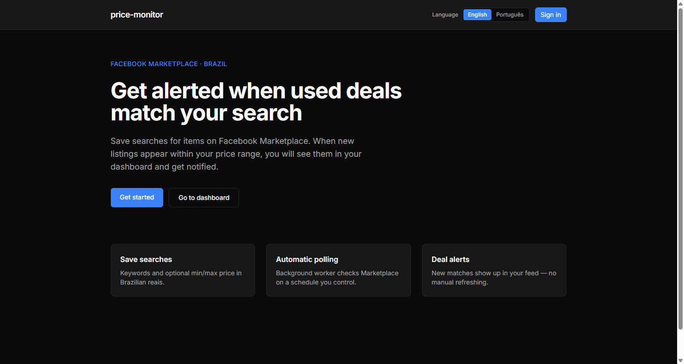
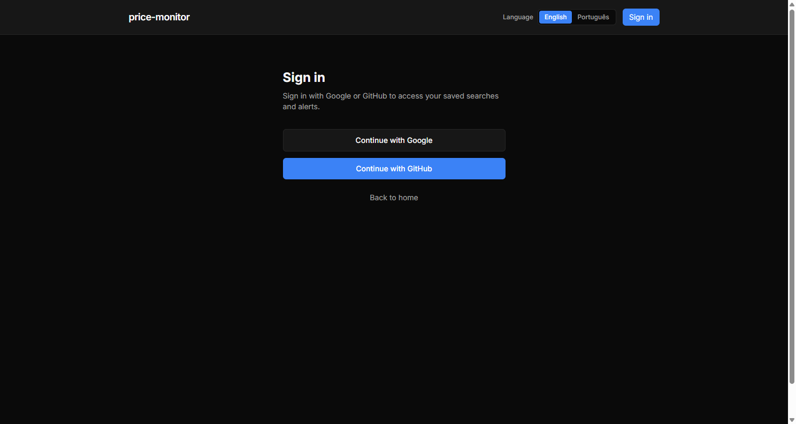
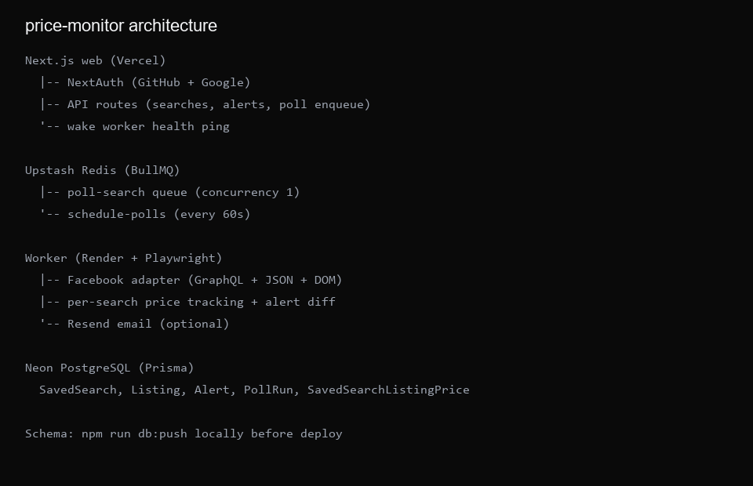

# price-monitor


[](https://fb-price-monitor.vercel.app)

**Full-stack Facebook Marketplace deal tracker** for Brazil. Save keyword + price searches, poll Marketplace on a schedule, and get dashboard alerts (and optional email) when new listings match or prices drop.

This is a **personal, educational, and portfolio project** — useful for exploring scraping resilience, job queues, and split serverless/long-running deploys. It is **not** authorized Facebook/Meta tooling. See [Legal notice](#legal-notice).

**What it does:** save searches → background worker scrapes Marketplace → diff against per-search history → alerts + email.  
**How it's built:** Next.js, BullMQ, Playwright, Prisma/Neon, Redis/Upstash, Resend — web on Vercel, worker on Render.  
**Scope and limits:** single-user OAuth, concurrency-1 polling, manual `db:push` before deploy — see [Operational assumptions](#operational-assumptions) and [design decisions](docs/design-decisions.md).

## Live links

| Service | URL |
|---------|-----|
| Web (Vercel) | [https://fb-price-monitor.vercel.app](https://fb-price-monitor.vercel.app) |
| Worker health (Render) | [https://price-monitor-worker.onrender.com/health](https://price-monitor-worker.onrender.com/health) |

## Highlights

- **57 automated tests** — Brazilian price parsing, Facebook URL/DOM/JSON parsers, poll schedule backoff, rate limits, price-drop logic, email HTML safety, Zod schemas, adapter merge priority
- **Resilient Facebook scraping** — GraphQL interception + embedded JSON + DOM fallback with unified merge; scroll depth scales with listing limit
- **Per-search price memory** — `SavedSearchListingPrice` tracks last seen price per search so drops are detected correctly across overlapping searches
- **Reliable polling** — BullMQ job dedup, concurrency 1, exponential failure backoff, stale RUNNING recovery, abort if search deleted mid-poll
- **Split deploy** — Vercel for UI/API; Render Docker worker for Playwright; Upstash Redis queue; Neon Postgres
- **Brazil-first UX** — `pt-BR` default, BRL cents, Marketplace location hints; English supported
- **Mock mode** — fake listings without Facebook session for local alert/email testing

## Screenshots

Public pages only (no auth required):

| Landing | Sign in |
|---------|---------|
|  |  |

| Architecture |
|--------------|
|  |

## Capabilities

| Area | What you get |
|------|----------------|
| **Saved searches** | Keywords, optional min/max price (BRL), poll interval (5–1440 min), listing limit (12/24/48), enable/disable |
| **Polling** | Manual **Poll now** (15 min cooldown) + scheduler every 60s; live status banner and poll run history |
| **Alerts** | New matches and price-drop badges; sort by date/price; dismiss per alert or clear all |
| **Email** | Resend HTML + plain text from worker; respects user notification toggle; no email on baseline poll |
| **Auth** | GitHub + Google OAuth via NextAuth v5 |
| **i18n** | Portuguese (default) and English |

## Quickstart (local)

Requires Node.js 18+.

```bash
cd price-monitor
npm install
npx playwright install chromium
cp .env.example .env
cp .env.example apps/web/.env.local   # fill AUTH_* and shared URLs
npm run db:push
```

**Terminal 1 — web:**

```bash
npm run dev --workspace=@price-monitor/web
```

**Terminal 2 — worker:**

```bash
npm run worker:dev
```

Open [http://localhost:3000](http://localhost:3000), sign in, create a search, click **Poll now**.

### Mock mode (no Facebook session)

In root `.env`:

```
MOCK_MARKETPLACE=true
```

Restart the worker. Polls return fake listings — useful for alerts and email without Playwright.

### Live Facebook polling

```bash
npm run save:facebook-session
```

Then in root `.env`:

```
FACEBOOK_STORAGE_STATE_PATH=facebook-storage-state.json
PLAYWRIGHT_HEADLESS=false
MOCK_MARKETPLACE=false
```

## Tests

```bash
npm test
```

## Deploy

### Database schema (before deploy)

Vercel and Render run `postinstall` → `db:generate` (Prisma Client only). They do **not** update Neon automatically.

After schema changes (`packages/database/prisma/schema.prisma`):

```bash
# .env → production DATABASE_URL
npm run db:push
```

Then deploy web (Vercel) and worker (Render).

**Web (Vercel):** Root Directory `apps/web`. Env: `DATABASE_URL`, `REDIS_URL`, `AUTH_*`, OAuth keys, `APP_URL`, `WORKER_HEALTH_URL`.

**Worker (Render):** Blueprint from `render.yaml`. Env: `DATABASE_URL`, `REDIS_URL`, `RESEND_API_KEY`, `EMAIL_FROM`, `APP_URL`. Upload `facebook-storage-state.json` as a secret file.

See [docs/render-deploy.md](docs/render-deploy.md) for the full walkthrough.

## API

| Endpoint | Description |
|----------|-------------|
| `GET/POST/PATCH /api/searches` | List, create, update saved searches |
| `DELETE /api/searches/[id]` | Delete search (cancel job; 409 if poll active) |
| `POST /api/searches/[id]/poll` | Enqueue manual poll (rate limited) |
| `GET /api/searches/[id]/poll-status` | BullMQ job state + queue message |
| `GET /api/searches/[id]/poll-runs` | Poll history (`?limit=`) |
| `GET /api/alerts` | Alert feed (`?savedSearchId=`, `?limit=`) |
| `DELETE /api/alerts/[id]` | Dismiss alert |
| `GET/PATCH /api/user/preferences` | Email notifications + locale |
| `GET /health` (worker) | Render health check + UptimeRobot wake target |

## Architecture

See [docs/architecture.md](docs/architecture.md) for the full diagram, poll lifecycle, and storage model.

## Operational assumptions

This project is a **personal deal-alert tool**, not production scraping infrastructure. Key simplifications:

### Scraping

- **Logged-in session required** — Playwright uses exported `facebook-storage-state.json`; sessions expire and must be refreshed manually.
- **No official API** — HTML/GraphQL/DOM parsing can break when Facebook changes the UI.
- **Concurrency 1** — one poll at a time to protect memory and rate limits.
- **Resource blocking** — images/fonts/media blocked in Playwright; trades fidelity for Render free-tier stability.

### Polling

- **Baseline poll** — first successful poll records matches without email.
- **Failure backoff** — consecutive failures increase delay up to 24h before the scheduler retries.
- **Manual cooldown** — Poll now limited to once per 15 minutes per search.

### Deploy

- **Worker spin-down** — Render free tier sleeps without traffic; UptimeRobot or Poll now wakes it.
- **Schema is manual** — run `npm run db:push` before deploy when Prisma schema changes.

For rationale behind each choice, see [docs/design-decisions.md](docs/design-decisions.md).

## Configuration

See `.env.example`. Key variables:

| Variable | Description |
|----------|-------------|
| `DATABASE_URL` | PostgreSQL (Neon) |
| `REDIS_URL` | Upstash Redis for BullMQ |
| `AUTH_SECRET` | NextAuth secret |
| `WORKER_HEALTH_URL` | Render `/health` URL (wake on Poll now) |
| `RESEND_API_KEY` | Email (worker only) |
| `MOCK_MARKETPLACE` | Skip Playwright; return fake listings |
| `FACEBOOK_STORAGE_STATE_PATH` | Path to saved Facebook session |

## Portfolio assets

Regenerate landing, sign-in, and architecture diagram:

```bash
python scripts/build-portfolio-assets.py
```

Capture `price-monitor-landing-en.png` and `price-monitor-sign-in-en.png` from the live site (or local dev) into Cursor screenshots before running the script.

## Design decisions

Extended write-up: [docs/design-decisions.md](docs/design-decisions.md).

## Legal notice

Facebook prohibits unauthorized automated data collection without permission. This project is intended for **personal, educational, and portfolio use**. You are responsible for complying with Meta's terms and applicable laws.

## License

See [LICENSE](LICENSE).
