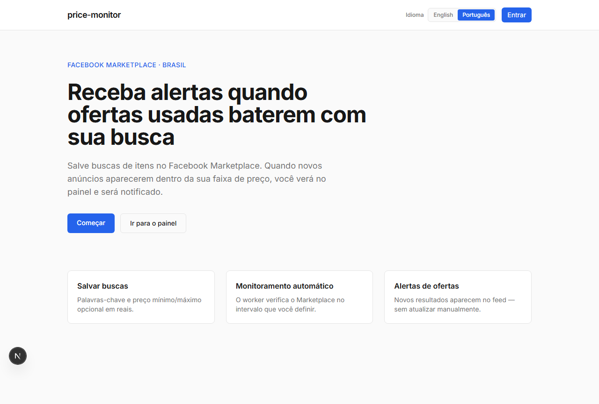
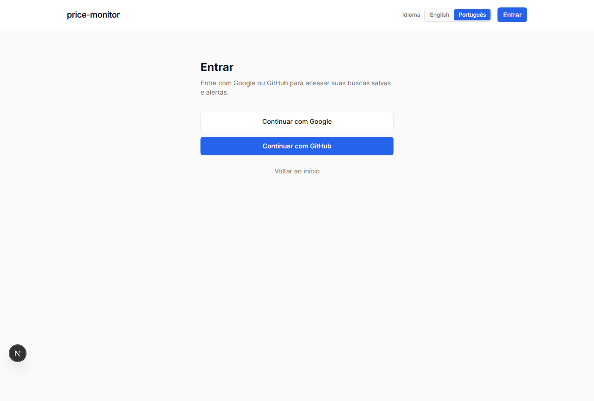
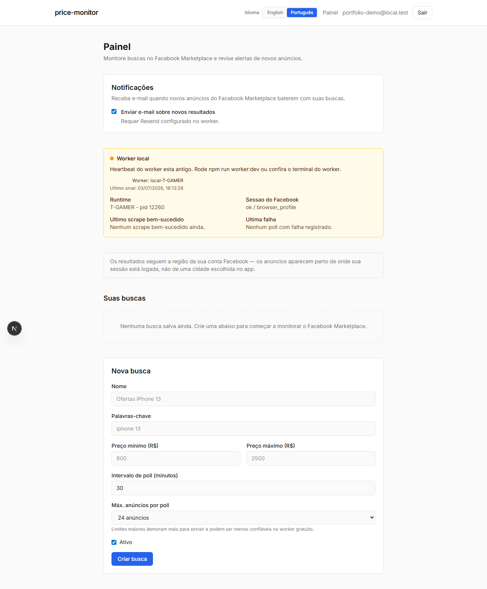
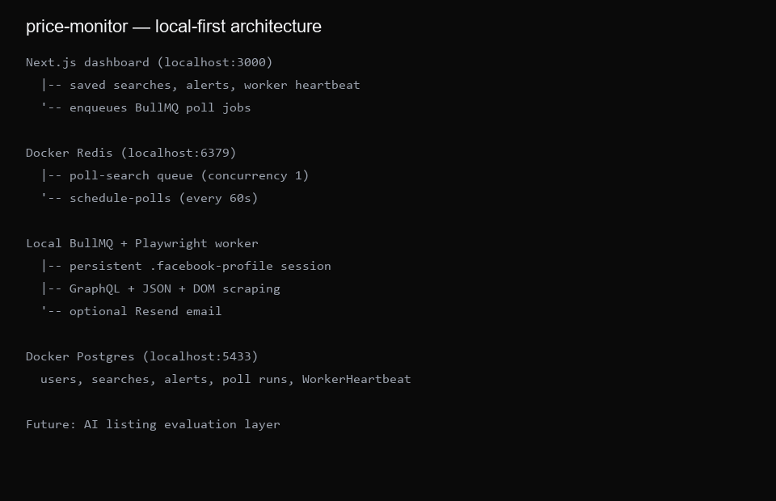

# price-monitor


**Local-first Facebook Marketplace deal monitor** for Brazil. Save keyword + price searches, run a local Playwright worker with your own Facebook browser profile, and review matching listings, price drops, and worker health in a polished dashboard.

This is a **personal, educational, and portfolio project** for exploring scraping resilience, job queues, and local automation. It is **not** authorized Facebook/Meta tooling.

**What it does:** save searches → local worker scrapes Marketplace → diff against per-search history → dashboard alerts + optional email.

**How it's built:** Next.js, BullMQ, Playwright, Prisma, local Docker Postgres/Redis, Resend, and a persistent local Facebook browser profile.

**Scope and limits:** local worker required, Facebook session is manual — see [Legal notice](#legal-notice) and [design decisions](docs/design-decisions.md).

## Highlights

- **142 automated tests** — Brazilian price parsing, Facebook parsers, poll schedule backoff, rate limits, price-drop logic, deal-quality signals, email HTML safety, localized alert emails and poll queue messages, Zod schemas, adapter merge priority, poll job cleanup, API route auth/ownership/cooldown, middleware path guards
- **Local-first worker** — Facebook-facing browser/session stays on your machine in `.facebook-profile/`
- **Worker heartbeat dashboard** — online/stale/offline state, Facebook session mode, latest successful scrape, and latest failure type
- **Resilient Facebook scraping** — GraphQL interception + embedded JSON + DOM fallback with unified merge
- **Per-search price memory** — `SavedSearchListingPrice` tracks last seen price per search so overlapping searches still detect drops correctly
- **Reliable polling** — BullMQ job dedup, concurrency 1, exponential failure backoff, stale RUNNING recovery, and manual poll cooldown
- **Brazil-first UX** — `pt-BR` default, BRL cents, Marketplace location hints, with English supported

| Landing | Sign in |
|---------|---------|
|  |  |

| Dashboard (local worker online) | Architecture |
|---------------------------------|--------------|
|  |  |

## Capabilities

| Area | What you get |
|------|----------------|
| **Saved searches** | Keywords, optional min/max price (BRL), poll interval (5–1440 min), listing limit (12/24/48), enable/disable |
| **Polling** | Manual **Poll now** (15 min cooldown) + scheduler every 60s; live status banner and poll run history |
| **Alerts** | New matches and price-drop badges; deal-quality signals (lowest seen, below recent average); sort by date/price; dismiss per alert or clear all |
| **Worker health** | Postgres heartbeat, session mode, latest scrape/failure summaries in the dashboard |
| **Email** | Optional Resend HTML + plain text from worker; respects user notification toggle; baseline scans do not send email |
| **Auth** | GitHub + Google OAuth via NextAuth v5 |
| **i18n** | Portuguese (default) and English |

## Quickstart

Requires Node.js 18+, Docker Desktop, and Playwright Chromium.

```bash
cd price-monitor
npm install
npx playwright install chromium
cp .env.example .env
cp apps/web/.env.example apps/web/.env.local
npm run docker:up
npm run db:push
npm run facebook:login
npm run spike:facebook
```

Fill in `AUTH_*` OAuth values in `apps/web/.env.local`. The web app and worker must use the **same** `DATABASE_URL` and `REDIS_URL`.

Terminal 1 — web:

```bash
npm run dev --workspace=@price-monitor/web
```

Terminal 2 — worker:

```bash
npm run worker:dev
```

Open [http://localhost:3000](http://localhost:3000), sign in, create a search, and click **Poll now**. The dashboard should show the local worker heartbeat once `npm run worker:dev` is running.

## Facebook Session Model

The recommended workflow is a persistent local browser profile:

```env
FACEBOOK_BROWSER_PROFILE_DIR=.facebook-profile
PLAYWRIGHT_HEADLESS=false
```

Run `npm run facebook:login` whenever Facebook asks for login, 2FA, checkpoint, or confirmation. The profile is ignored by git and should never be committed.

## Tests

```bash
npm test
```

## API

| Endpoint | Description |
|----------|-------------|
| `GET/POST/PATCH /api/searches` | List, create, update saved searches |
| `DELETE /api/searches/[id]` | Delete search (cancel job; 409 if poll active) |
| `POST /api/searches/[id]/poll` | Enqueue manual poll (rate limited) |
| `GET /api/searches/[id]/poll-status` | BullMQ job state + queue message |
| `GET /api/searches/[id]/poll-runs` | Poll history (`?limit=`) |
| `GET /api/alerts` | Alert feed (`?savedSearchId=`, `?limit=`) |
| `DELETE /api/alerts/[id]` | Dismiss alert |
| `GET/PATCH /api/user/preferences` | Email notifications + locale |
| `GET /health` (worker) | Local worker health and Facebook session check |

## Architecture

See [docs/architecture.md](docs/architecture.md) for the full diagram and data flow.

## Configuration

See `.env.example`. Key variables:

| Variable | Description |
|----------|-------------|
| `DATABASE_URL` | PostgreSQL, local Docker by default (port 5433) |
| `REDIS_URL` | Redis for BullMQ, local Docker by default |
| `AUTH_SECRET` | Auth.js / NextAuth secret |
| `RESEND_API_KEY` | Optional email alerts, used by the worker |
| `FACEBOOK_BROWSER_PROFILE_DIR` | Persistent local Facebook browser profile |

## Design decisions

Extended write-up of architecture and product choices: [docs/design-decisions.md](docs/design-decisions.md).

## Legal notice

Facebook prohibits unauthorized automated data collection without permission. This project is intended for **personal, educational, and portfolio use**. You are responsible for complying with Meta's terms and applicable laws.

## License

See [LICENSE](LICENSE).
